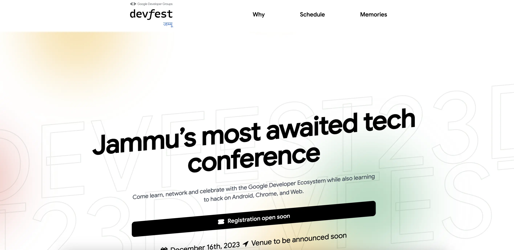

# DevFest Jammu 2023 Wesbite [WIP]



Website for DevFest Jammu 2023. This site was built using [Devfest2022-web](https://github.com/gdgchennai/devfest2022-web) (Thanks to GDG Chennai)

## Technology

This website is built using SvelteKit and TailwindCSS.

## Deployment

Auto Deployed with Cloudflare Pages.

### Deployment steps

* Build Command: `npm run build`
* Build output directory: `/.svelte-kit/cloudflare`
* Root directory: `/`

## Development

Follow these steps to locally setup this project.

```bash
npm install
npm run dev
```

## License

This project uses [MIT](LICENSE.txt) license.
